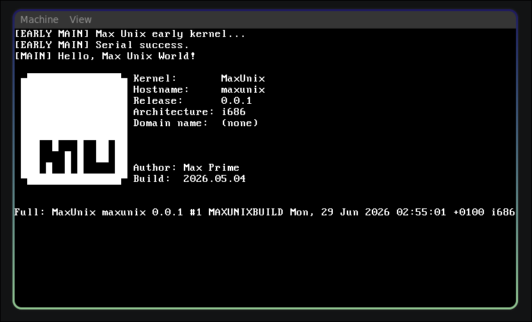

# Manix (Max Unix)

> **⚠ Warning**<br> Manix is in very early alpha development stages and this OS sucks. This 100% isn't going to be better than any other Unix-based OS for any reason. If you are like me and do just like to check out other people's OS instead of making your own though, be my guest.

## About
**Manix (Max Unix)** is a hobby operating system made by me, Max Prime! I've been using Linux for over 2 years (Arch, btw) and I have loved the prospect of OS development maybe since I was 7 or so. I have always wanted to build and OS where I keep enough unix to feel at home but enough difference to feel like I haven't reinvented the wheel. So, here I am doing weird and random things that are almost intentional in how much they break POSIX. Oh yeah, if you are looking for something POSIX compliant to see if your program runs on it, you're in the wrong place



## Prerequisites
You will need make, and that is about it. For packages that you can just install from the command line that is. On top of this, you will need to bring your own previously-compiled i686-elf target GCC and AS. Once you have done this, the makefile will do everything else and build nicely with "make".

QEMU is used in the makefile for emulation, and xorriso and mtools is required for the "make iso" isoimage function.

## Build
I used this project somewhat as an excuse to learn Makefiles. Thank god I did, the build script was getting out of hand.

To build, just use the make file.
```
make
```

To then run your file using qemu,
```
make qemu
```

If you want to generate an iso image, then you can both build and run it with the same build function.
```
make iso
```

## Contributing
no

## Easter egg! (The original README.md for those who are curious)

**From: max@maxprime.dev (Max Prime)**

**Date: 17 Dec 25 20:14:44 GMT**

Hello everybody out there using linux -

I'm doing a (free) operating system (just a hobby, won't be big and professional like linux) for my x86(64) clones.

yeah yeah okay jokes over. but seriously, this will not spew into something massive. i honestly don't have the time or will power for that. who knows, maybe ill generate a community so large that I can actually get other people to do it for me lol.
